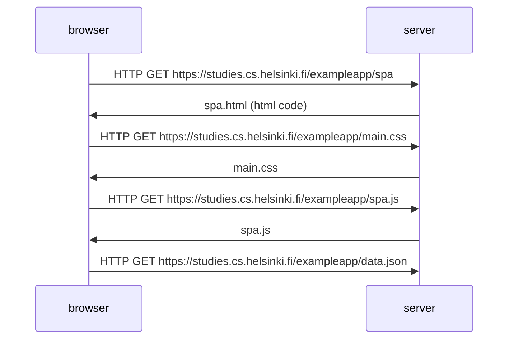

```mermaid
sequenceDiagram
participant browser
participant server
browser ->> server: HTTP GET https://studies.cs.helsinki.fi/exampleapp/spa
server ->> browser: spa.html (html code)
browser ->> server:HTTP GET https://studies.cs.helsinki.fi/exampleapp/main.css
server ->> browser: main.css
browser ->> server: HTTP GET https://studies.cs.helsinki.fi/exampleapp/spa.js
server ->> browser: spa.js

%%browser gets the js file, starts running js file

browser ->> server: HTTP GET https://studies.cs.helsinki.fi/exampleapp/data.json

%%Redraws notes, displaying notes as a ul with li being the json content

```
