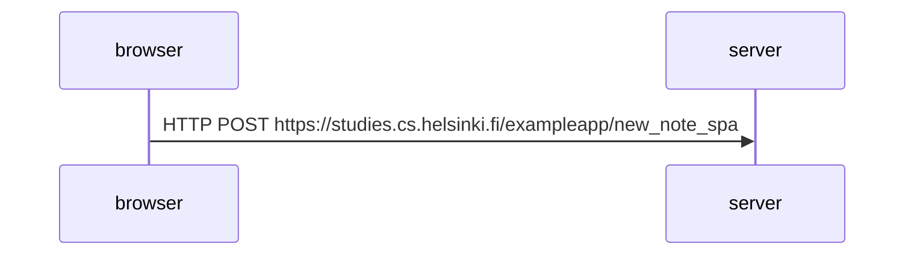

```mermaid
sequenceDiagram
participant browser
participant server
browser ->> server: HTTP POST https://studies.cs.helsinki.fi/exampleapp/new_note_spa
%%browser updates its own array note with new submitted value
%%browser then empties field of form
%%browser redraws notes with new note inside
%%it then sends the note over to server
%%server infers how to parse data from Content-Type, which is json
%%server then adds new note to data.json
%%server responds with status code 201, but does not redirect
```
